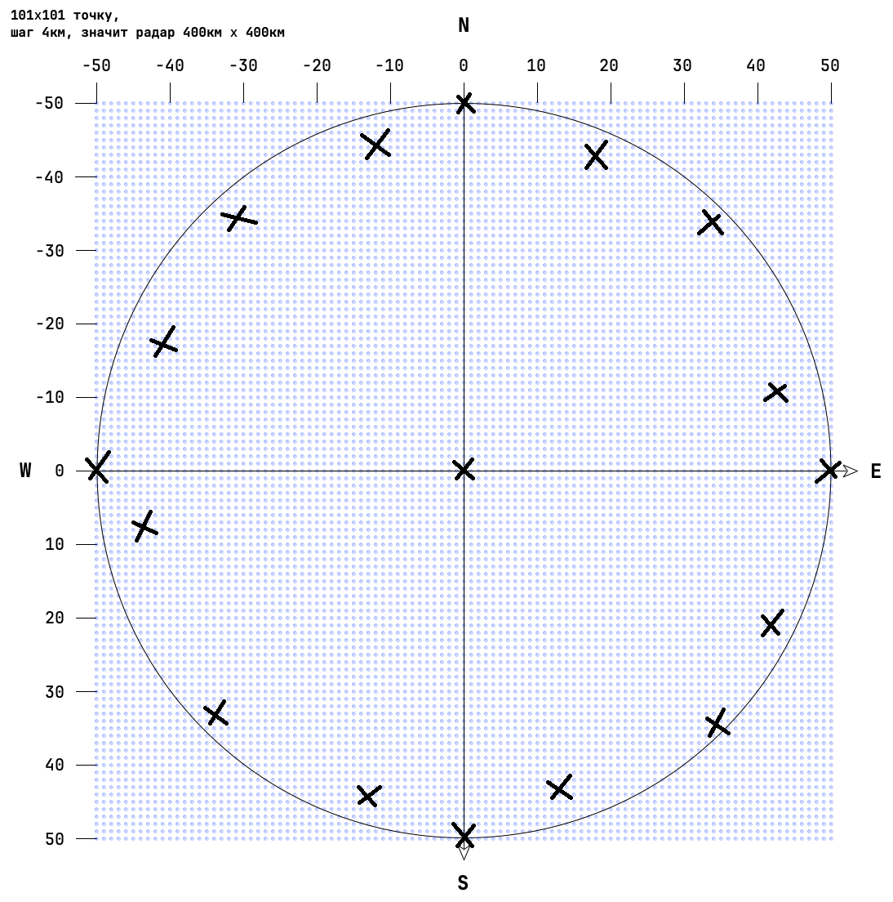

# Запуск

1. установить пакеты
2. запустить `npm run test`

вся логика проверки написана в тесте: `src\__tests__\check\my.test.ts`

# TODO

Написать тесты

- для всех станций
- для точек с плоскости данных:
  

